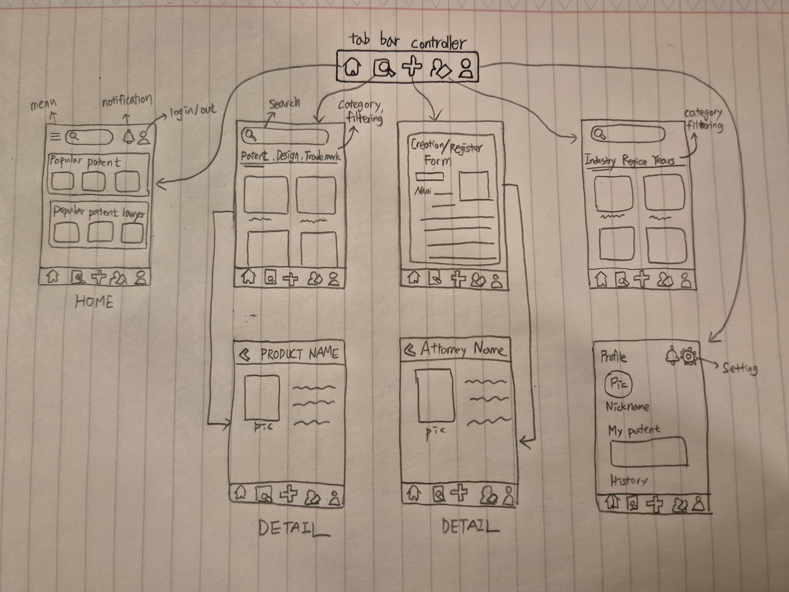
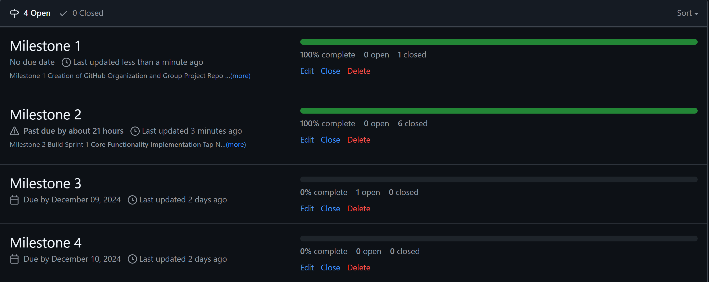
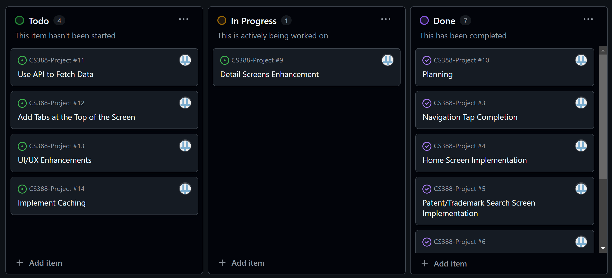
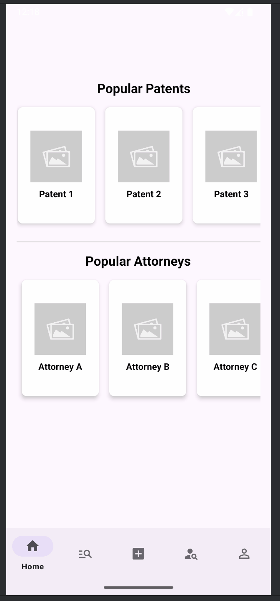
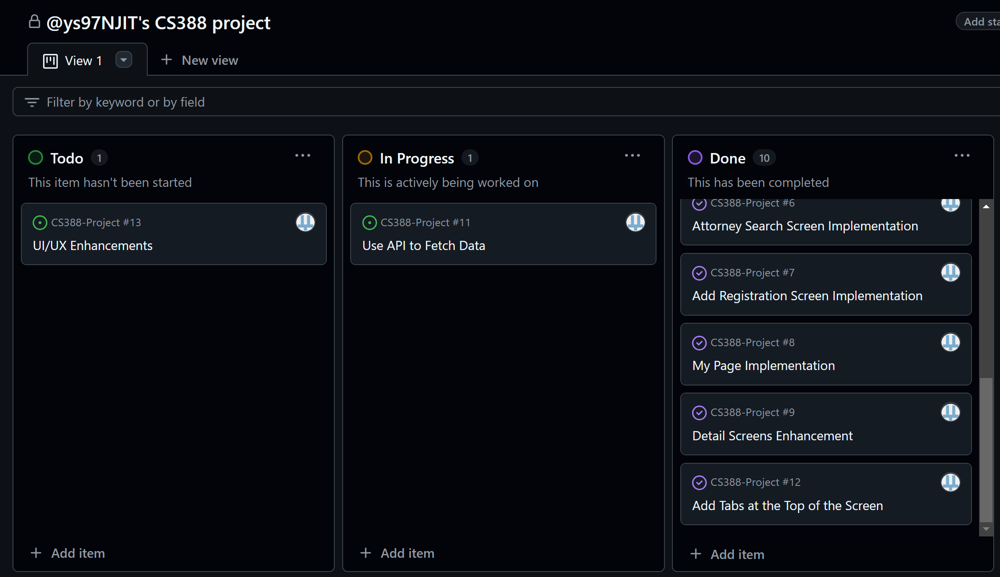
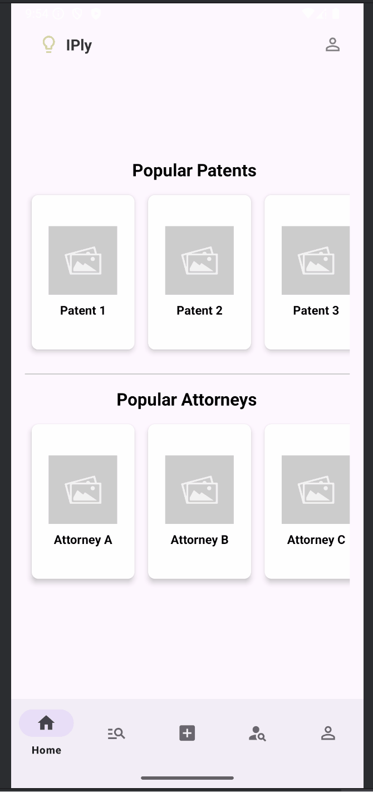

# Brainstorming: App Ideas

## Idea 1: Patent/Trademark Platform
- **Description**: An app where users can register and manage patents or trademarks and connect with patent attorneys.
- **Objective**: Simplify intellectual property management and professional connections.

## Idea 2: Study Management App
- **Description**: An app that helps students plan their studies and track progress.
- **Objective**: Enhance productivity and motivation for learning.

## Idea 3: Eco-Friendly Checklist App
- **Description**: An app to record and manage small daily actions for environmental protection.
- **Objective**: Encourage sustainable behavior.

## Idea 4: Social Event Matching App
- **Description**: A platform where people with similar interests can organize or join events.
- **Objective**: Strengthen communities and networking opportunities.

## Idea 5: Health and Fitness Reminder
- **Description**: A notification app to manage healthy habits like drinking water or exercising.
- **Objective**: Promote a healthy lifestyle.

## Idea 6: Local Food Recommendation App
- **Description**: An app that suggests highly rated restaurants near the user based on reviews.
- **Objective**: Make dining decisions easier.

# Idea Evaluation
| Idea                   | Mobile Adaptability | Story  | Market Size | Usage Frequency | Feasibility | Total Score |
|------------------------|---------------------|--------|-------------|-----------------|-------------|-------------|
| Patent/Trademark       |          5          |   5    |      4      |        4        |      5      |     23      |
| Study Management App   |          4          |   3    |      3      |        4        |      4      |     18      |
| Eco-Friendly Checklist |          3          |   5    |      2      |        3        |      3      |     16      |
| Social Event Matching  |          4          |   4    |      4      |        4        |      3      |     19      |
| Health & Fitness       |          5          |   3    |      3      |        5        |      4      |     20      |
| Local Food             |          5          |   3    |      5      |        3        |      4      |     20      |

## Final App Idea: Patent/Trademark Platform
### Reason
1. High demand for mobile-based intellectual property management and professional connections.
2. Large market size with limited direct competitors.
3. Feasible for an MVP and scalable for future feature additions.

# Milestone 1 - Patent/Trademark Platform MVP (Unit 7)

## Table of Contents

1. [Overview](#Overview)
1. [Product Spec](#Product-Spec)
1. [Wireframes](#Wireframes)

## Overview

### Description

The Patent/Trademark Platform MVP simplifies intellectual property management, allowing users to register and track patents/trademarks while connecting them with patent attorneys for professional support. The app features a centralized navigation system through a Controller Bar, enabling seamless access to Home, Patent Search, Add Registration, Attorney Search, and My Page screens.

### App Evaluation

- **Category:** Productivity/Legal  
- **Mobile:** Utilizes mobile-friendly features like push notifications and a streamlined user interface for on-the-go management.  
- **Story:** Addresses the challenge of managing intellectual property and finding professional legal assistance.  
- **Market:** Inventors, startups, and businesses needing intellectual property management tools.  
- **Habit:** Designed for periodic use to update and monitor intellectual property and interact with attorneys.  
- **Scope:** Focused on essential features like IP registration, attorney search, and notifications, with scalability for future enhancements.

## Product Spec

### 1. User Features (Required and Optional)

**Required Features**

1. User login and registration with email-based authentication.
2. Controller Bar for seamless navigation between screens (Home, Patent Search, Add Registration, Attorney Search, My Page).
3. Home Screen: Displays popular patents and attorneys. Clickable items navigate to detailed views.
4. Patent/Trademark Search: Search patents by industry or IP type. Detailed view for selected patents.
5. Attorney Search: Search attorneys by location or expertise. Detailed view for selected attorneys.
6. Add Registration Screen: Form for registering new patents or trademarks. Fields include name, description, registration number, and date.

**Optional Features**

1. Attorney recommendations based on user activity or location.
2. In-app chat with attorneys.
3. Data backup using cloud storage.

### 2. Screen Archetypes

- **Login Screen**  
  - User enters email and password to log in or register.  

- **Home Screen**  
  - Displays a list of popular patents/trademarks and featured attorneys. 
  - Each item is clickable and navigates to a detailed view.

- **Patent/Trademark Search Screen**  
  - Includes search filters (by industry, IP type).
  - Displays a searchable list of patents.
  - Each patent is clickable and navigates to a detailed view.

- **Patent Detail Screen**  
  - Displays detailed information about a selected patent (name, description, registration number, status).

- **Attorney Search Screen**  
  - Includes filters (by location, expertise).
  - Displays a list of attorneys.
  - Each attorney is clickable and navigates to a detailed profile view.

 - **Attorney Detail Screen**  
  - Displays detailed attorney information (name, specialization, contact info).

- **Add Registration Screen**  
  - Allows users to fill out a form to register new patents/trademarks.

 - **My Page Screen**  
  - Displays user account information.
  - Includes logout and settings options.

### 3. Navigation

**Tab Navigation** (Tab to Screen)

- Home: Displays popular patents and attorneys.
- Patent Search: Allows users to search patents by filters and view details.
- Add Registration: Displays the registration form.
- Attorney Search: Allows users to search attorneys and view details.
- My Page: Displays account information and settings.

**Flow Navigation** (Screen to Screen)
- Login → Home Screen: Successful login redirects to the main Home Screen.
- Home → Patent Detail Screen: Clicking a patent navigates to its detailed view.
- Home → Attorney Detail Screen: Clicking an attorney navigates to their detailed profile.
- Patent Search → Patent Detail Screen: Clicking a search result navigates to its detailed view.
- Attorney Search → Attorney Detail Screen: Clicking a search result navigates to their profile.
- Add Registration → Home Screen: After saving a new registration, the user returns to Home.

## Wireframes

[Add picture of your hand sketched wireframes in this section]  

 

 

### [BONUS] Digital Wireframes & Mockups

[Include any digital wireframes or mockups if applicable]  

 

### [BONUS] Interactive Prototype

[Link or embed the interactive prototype here]  

---

# Milestone 2 - Build Sprint 1 (Unit 8)

## GitHub Project board

[Add screenshot of your Project Board with three milestones visible in this section]  

## Issue cards

- [Add screenshot of your Project Board with the issues that you've been working on for this unit's milestone]  
- [Add screenshot of your Project Board with the issues that you're working on in the **NEXT sprint**. It should include issues for next unit with assigned owners.]  
  

## Issues worked on this sprint

- List the issues you completed this sprint  
- [Add giphy that shows current build progress for Milestone 2. Note: We will be looking for progression of work between Milestone 2 and 3. Make sure your giphys are not duplicated and clearly show the change from Sprint 1 to 2.]
-  

---

# Milestone 3 - Build Sprint 2 (Unit 9)

## GitHub Project board

[Add screenshot of your Project Board with the updated status of issues for Milestone 3. Note that these should include the updated issues you worked on for this sprint and not be a duplicate of Milestone 2 Project board.]  

## Completed user stories

- List the completed user stories from this unit.  
- List any pending user stories / any user stories you decided to cut from the original requirements.  

[Add video/gif of your current application that shows build progress]  

## App Demo Video

- Embed the YouTube/Vimeo link of your Completed Demo Day prep video
- Slides: https://docs.google.com/presentation/d/12DqASmYlspr18UEj1-gduzzIXWQi37lRsR0_RAVzksY/edit?usp=sharing
- Presentation: https://docs.google.com/presentation/d/12DqASmYlspr18UEj1-gduzzIXWQi37lRsR0_RAVzksY/edit?usp=sharing
